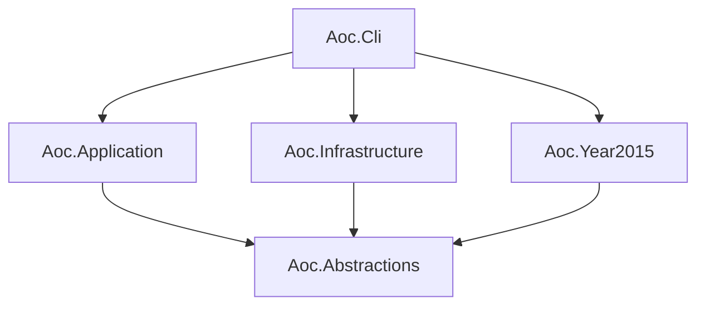

# 🎄 Advent of Code Lab

[](https://github.com/lkdrm/Advent_of_Code_Lab/actions/workflows/ci.yml)


A modern .NET learning platform for solving, running, testing, and documenting [Advent of Code](https://adventofcode.com/) puzzles.

This repository focuses not only on finding the correct answers, but also on writing maintainable C# code with clear architecture, dependency injection, automated tests, documentation, and continuous integration.
> [!TIP]
> Explore the complete [Advent of Code Lab Wiki](https://github.com/lkdrm/Advent_of_Code_Lab/wiki) for architecture guides, development workflows, testing strategy, troubleshooting, C# deep dives, and puzzle algorithm notes.

## About the project

Advent of Code Lab is a modern rework of my original [AdventOfCode-2015](https://github.com/lkdrm/AdventOfCode-2015) repository.

The original project focused mainly on solving individual puzzles. This version is being rebuilt from the ground up as a structured .NET application with:

- clear separation of responsibilities;
- reusable puzzle abstractions;
- dependency injection;
- asynchronous input loading;
- an interactive console interface;
- automated tests;
- GitHub Actions CI;
- detailed step-by-step guides;
- documented implementation decisions.

Each puzzle day is developed incrementally and treated as a complete feature.

## Features

- Interactive CLI powered by `Spectre.Console`
- Selection of puzzle year and day
- Automatic puzzle discovery and singleton DI registration through assembly scanning
- Demo and personal input modes
- Part One, Part Two, or Both execution
- Execution-time measurement
- Asynchronous file-based input loading
- Unit tests for puzzles, application services, and infrastructure
- GitHub Actions build and test validation
- Protected `main` branch with required CI checks
- XML documentation comments
- Detailed Markdown guides for every completed puzzle
- Structured puzzle-execution logging
- Daily rolling JSON diagnostic logs
- User-friendly CLI error handling
- Comprehensive GitHub Wiki for architecture, workflows, quality practices, and learning notes

## Technology stack

| Technology | Purpose |
| --- | --- |
| .NET 10 | Application platform |
| C# | Puzzle and application implementation |
| Spectre.Console | Interactive console interface |
| Microsoft.Extensions.DependencyInjection | Dependency injection |
| xUnit | Automated testing |
| Coverlet | Code coverage collection |
| GitHub Actions | Continuous integration |
| Markdown | Step-by-step puzzle documentation |
| Microsoft.Extensions.Logging | Application logging abstraction |
| Serilog | Structured rolling JSON log provider |
| Scrutor | Assembly scanning and convention-based puzzle registration |

The required SDK version is defined in `global.json`:

```text
.NET SDK 10.0.301
```

## Quick start

### Prerequisites

Install the [.NET 10 SDK](https://dotnet.microsoft.com/download/dotnet/10.0).

Verify your installation:

```bash
dotnet --version
```

### Clone the repository

```bash
git clone https://github.com/lkdrm/Advent_of_Code_Lab.git
cd Advent_of_Code_Lab
```

### Restore and build

```bash
dotnet restore AdventOfCodeLab.slnx
dotnet build AdventOfCodeLab.slnx
```

### Run the CLI

```bash
dotnet run --project src/Aoc.Cli/Aoc.Cli.csproj
```

The interactive menu allows you to select:

1. a registered puzzle;
2. Demo or Personal input;
3. Part One, Part Two, or Both.

After execution, the CLI displays the answer and execution time for every selected part.

## Available puzzles

### Advent of Code 2015

| Day | Puzzle | Key concepts | Guide |
| ---: | --- | --- | --- |
| 01 | [Not Quite Lisp](https://adventofcode.com/2015/day/1) | Sequential processing, switch expressions, early exit, one-based indexing | [Read guide](docs/2015/day01-not-quite-lisp.md) |
| 02 | [I Was Told There Would Be No Math](https://adventofcode.com/2015/day/2) | Input parsing, record structs, geometry calculations, aggregation | [Read guide](docs/2015/day02-i-was-told-there-would-be-no-math.md) |
| 03 | [Perfectly Spherical Houses in a Vacuum](https://adventofcode.com/2015/day/3) | Coordinate systems, tuples, HashSet, alternating turns | [Read guide](docs/2015/day03-perfectly-spherical-houses-in-a-vacuum.md) |

More puzzle days will be added incrementally.

## Application architecture

The solution separates puzzle contracts, execution logic, infrastructure, puzzle implementations, and user interaction.



### Project responsibilities

| Project | Responsibility |
| --- | --- |
| `Aoc.Abstractions` | Shared contracts, puzzle identifiers, metadata, input types, and result models |
| `Aoc.Application` | Puzzle lookup, input coordination, execution, and timing |
| `Aoc.Infrastructure` | File-based loading of demo and personal inputs |
| `Aoc.Year2015` | Advent of Code 2015 puzzle implementations and automatic DI registration through assembly scanning |
| `Aoc.Cli` | Application startup, interactive menu, and result presentation |
| `Aoc.Abstractions.Tests` | Tests for identifiers, metadata, and shared contracts |
| `Aoc.Application.Tests` | Tests for puzzle execution behavior and result models |
| `Aoc.Infrastructure.Tests` | Tests for file-based input loading |
| `Aoc.Year2015.Tests` | Tests for puzzle algorithms and automatic registration conventions |

## Execution flow

The CLI does not create or register puzzle classes manually.

Puzzle implementations are discovered automatically through assembly scanning:

```csharp
services.Scan(scan => scan
    .FromAssemblyOf<Year2015AssemblyMarker>()
    .AddClasses(classes => classes.AssignableTo<IPuzzle>())
    .As<IPuzzle>()
    .WithSingletonLifetime());
```

`Year2015AssemblyMarker` identifies the assembly to scan. Every public,
non-abstract class in `Aoc.Year2015` that implements `IPuzzle` is registered
automatically as a singleton.

The CLI receives all discovered `IPuzzle` implementations and displays them
without requiring changes to its startup code.

## Diagnostic logging

Puzzle execution produces structured diagnostic events through
`Microsoft.Extensions.Logging`.

Serilog writes the events as daily rolling JSON files without mixing diagnostic
output with the interactive Spectre.Console interface.

Runtime location:

```text
<Aoc.Cli output>/Logs/aoc-YYYYMMDD.json
```

| Event ID | Event name            | Level       | Meaning                                |
| -------: | --------------------- | ----------- | -------------------------------------- |
|     1000 | `ExecutionStarted`    | Information | A puzzle execution has started         |
|     1001 | `PuzzlePartCompleted` | Information | One puzzle part completed successfully |
|     1002 | `ExecutionCancelled`  | Information | Execution was cancelled                |
|     1003 | `ExecutionFailed`     | Error       | Execution failed with an exception     |

The logs include puzzle identifiers, selected parts, input kinds, execution
durations, and diagnostic exception details.

Puzzle input contents are never written to logs.

Log files:

- roll daily;
- roll when a file reaches 5 MB;
- retain the latest 14 files;
- remain local and are excluded from Git.

## Repository structure

```text
Advent_of_Code_Lab/
├── .github/
│   ├── workflows/
│   │   └── ci.yml
│   └── pull_request_template.md
│
├── docs/
│   └── 2015/
│       ├── day01-not-quite-lisp.md
│       ├── day02-i-was-told-there-would-be-no-math.md
│       └── day03-perfectly-spherical-houses-in-a-vacuum.md
│
├── src/
│   ├── Aoc.Abstractions/
│   ├── Aoc.Application/
│   ├── Aoc.Cli/
│   ├── Aoc.Infrastructure/
│   └── Aoc.Year2015/
│
├── tests/
│   ├── Aoc.Abstractions.Tests/
│   ├── Aoc.Application.Tests/
│   ├── Aoc.Infrastructure.Tests/
│   └── Aoc.Year2015.Tests/
│
├── AdventOfCodeLab.slnx
├── CONTRIBUTING.md
├── Directory.Build.props
├── global.json
└── README.md
```

## Puzzle inputs

The application supports two input types.

### Demo input

Demo inputs are safe example inputs committed to the repository.

Example:

```text
Inputs/demo/2015/day03.txt
```

They allow anyone to clone the repository and run completed puzzles immediately.

### Personal input

Personal Advent of Code inputs must remain local and must not be committed.

Expected runtime location:

```text
Inputs/local/2015/day03.txt
```

The local input directory is excluded through `.gitignore`.

## Running tests

Run the complete test suite:

```bash
dotnet test AdventOfCodeLab.slnx
```

Run only the puzzle tests:

```bash
dotnet test tests/Aoc.Year2015.Tests/Aoc.Year2015.Tests.csproj
```

Run tests for one puzzle day:

```bash
dotnet test --filter "FullyQualifiedName~Day03Tests"
```

The test suite covers different areas:

```text
Aoc.Abstractions.Tests
→ verifies identifiers, metadata, and shared contract invariants

Aoc.Application.Tests
→ verifies puzzle execution, result models, and orchestration behavior

Aoc.Infrastructure.Tests
→ verifies asynchronous file input loading

Aoc.Year2015.Tests
→ verifies individual puzzle algorithms
```

## Continuous integration

The GitHub Actions workflow runs for every push and pull request targeting `main`.

The CI pipeline performs:

```text
Restore dependencies
        ↓
Build the complete solution
        ↓
Run all automated tests
```

The `main` branch is protected.

A pull request cannot be merged until the required `Build and test` check has completed successfully.

### Automated pull request reporting

For pull requests created from branches in this repository, CI automatically updates generated sections of the pull request description with:

- a change summary grouped by Conventional Commit type;
- the number of commits and changed files;
- added and removed line counts;
- build status;
- total, passed, failed, and skipped test counts;
- the tested commit and a link to the workflow run.

Only content between the generated-section markers is replaced. Manually written summaries, puzzle details, and checklists are preserved.

Pull requests from forks still run build and tests, but the description updater is skipped to keep the workflow token read-only.

## Adding a new puzzle

Every new puzzle day follows the same workflow:

1. Create a separate branch.
2. Add a new `DayXX` class implementing `IPuzzle`.
3. Define its `PuzzleMetadata`.
4. Implement Part One and Part Two.
5. Extract shared logic where appropriate.
6. Verify that the puzzle is discovered automatically through dependency injection.
7. Add a demo input.
8. Add unit tests for both parts.
9. Add XML documentation comments.
10. Create a detailed guide in `docs/{year}`.
11. Run the complete test suite.
12. Verify the puzzle through the CLI.
13. Create a pull request.
14. Wait for the required CI check before merging.

Full development rules are available in [CONTRIBUTING.md](CONTRIBUTING.md).

## Documentation

Advent of Code Lab separates documentation by purpose:

| Resource | Purpose |
| --- | --- |
| [README](README.md) | Project overview, quick start, features, and current roadmap |
| [Project Wiki](https://github.com/lkdrm/Advent_of_Code_Lab/wiki) | Architecture, execution flow, dependency injection, testing, CI, troubleshooting, and C# deep dives |
| [Puzzle guides](docs/2015) | Detailed reasoning, algorithms, complexity, tests, and lessons for every completed Day |
| [CONTRIBUTING](CONTRIBUTING.md) | Branch, implementation, documentation, testing, and pull-request rules |

The Wiki explains how the complete laboratory works and why its architectural decisions were made.

Each completed puzzle guide preserves:

- the reduced computational problem;
- Part One and Part Two requirements;
- algorithm design;
- data-structure selection;
- step-by-step examples;
- complexity analysis;
- common mistakes;
- automated-test strategy;
- application integration;
- key learning outcomes.

The goal is to preserve not only the final solution, but also the reasoning that led to it.
## Learning goals

This project is being developed as a practical learning laboratory for modern .NET development.

Current areas of focus include:

- clean and maintainable C#;
- object-oriented design;
- dependency injection;
- asynchronous programming;
- collection selection;
- algorithmic thinking;
- testing strategies;
- application architecture;
- continuous integration;
- technical documentation.

## Roadmap


| Status | Milestone | Details |
| :---: | --- | --- |
| ✅ | Core architecture | Puzzle abstractions, application service, DI, and async input loading |
| ✅ | Interactive CLI | Spectre.Console menu, input selection, puzzle parts, and timing |
| ✅ | Testing | Puzzle, application, and infrastructure tests with xUnit |
| ✅ | Continuous integration | GitHub Actions restore, build, and test pipeline |
| ✅ | Protected workflow | Required pull requests, CI checks, and protected `main` |
| ✅ | Documentation standards | XML comments, guides, contribution rules, and PR checklist |
| ✅ | Project Wiki | Architecture, workflows, quality practices, troubleshooting, and learning guides |
| ✅ | Structured logging | Source-generated events and rolling JSON diagnostic logs |
| 🚧 | Advent of Code 2015 | `3 / 25` puzzle days completed |
| 📋 | Additional years | Add support for more Advent of Code events |
| 📋 | Code coverage | Generate and publish coverage reports |

### Current focus

Continue implementing Advent of Code 2015 one puzzle at a time. Every completed day must include:

- Part One and Part Two;
- unit tests;
- demo input;
- automatic discovery through the `IPuzzle` registration convention;
- XML documentation comments;
- a detailed Markdown guide;
- successful CLI execution;
- a green CI run.

## Acknowledgements

Puzzle descriptions and input data belong to [Advent of Code](https://adventofcode.com/), created by [Eric Wastl](https://was.tl/).

This repository contains personal implementations, tests, and educational documentation.