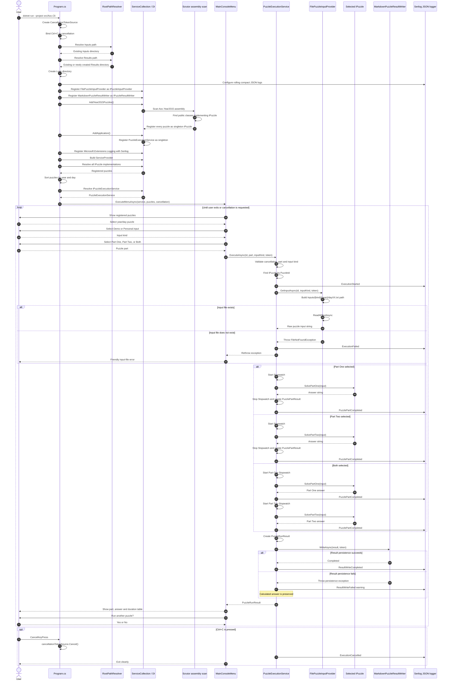

## 2. Complete startup and puzzle execution flow

```mermaid
sequenceDiagram
    autonumber

    actor User
    participant Program as Program.cs
    participant Paths as RootPathResolver
    participant DI as ServiceCollection / DI
    participant Scanner as Scrutor assembly scan
    participant Menu as MainConsoleMenu
    participant Execution as PuzzleExecutionService
    participant Input as FilePuzzleInputProvider
    participant Puzzle as Selected IPuzzle
    participant Writer as MarkdownPuzzleResultWriter
    participant Logger as Serilog JSON logger

    User->>Program: dotnet run --project src/Aoc.Cli
    Program->>Program: Create CancellationTokenSource
    Program->>Program: Bind Ctrl+C to cancellation

    Program->>Paths: Resolve Inputs path
    Paths-->>Program: Existing Inputs directory
    Program->>Paths: Resolve Results path
    Paths-->>Program: Existing or newly created Results directory
    Program->>Program: Create Logs directory
    Program->>Logger: Configure rolling compact JSON logs

    Program->>DI: Register FilePuzzleInputProvider as IPuzzleInputProvider
    Program->>DI: Register MarkdownPuzzleResultWriter as IPuzzleResultWriter
    Program->>DI: AddYear2015Puzzles()
    DI->>Scanner: Scan Aoc.Year2015 assembly
    Scanner->>Scanner: Find public classes implementing IPuzzle
    Scanner-->>DI: Register every puzzle as singleton IPuzzle
    Program->>DI: AddApplication()
    DI->>DI: Register PuzzleExecutionService as singleton
    Program->>DI: Register Microsoft.Extensions.Logging with Serilog
    Program->>DI: Build ServiceProvider

    Program->>DI: Resolve all IPuzzle implementations
    DI-->>Program: Registered puzzles
    Program->>Program: Sort puzzles by year and day
    Program->>DI: Resolve IPuzzleExecutionService
    DI-->>Program: PuzzleExecutionService
    Program->>Menu: ExecuteMenuAsync(service, puzzles, cancellation)

    loop Until user exits or cancellation is requested
        Menu->>User: Show registered puzzles
        User-->>Menu: Select year/day puzzle
        Menu->>User: Select Demo or Personal input
        User-->>Menu: Input kind
        Menu->>User: Select Part One, Part Two, or Both
        User-->>Menu: Puzzle part

        Menu->>Execution: ExecuteAsync(id, part, inputKind, token)
        Execution->>Execution: Validate cancellation, part and input kind
        Execution->>Execution: Find IPuzzle by PuzzleId
        Execution->>Logger: ExecutionStarted

        Execution->>Input: GetInputAsync(id, inputKind, token)
        Input->>Input: Build Inputs/{kind}/{year}/dayXX.txt path

        alt Input file exists
            Input->>Input: ReadAllTextAsync
            Input-->>Execution: Raw puzzle input string
        else Input file does not exist
            Input-->>Execution: Throw FileNotFoundException
            Execution->>Logger: ExecutionFailed
            Execution-->>Menu: Rethrow exception
            Menu-->>User: Friendly input-file error
        end

        alt Part One selected
            Execution->>Execution: Start Stopwatch
            Execution->>Puzzle: SolvePartOne(input)
            Puzzle-->>Execution: Answer string
            Execution->>Execution: Stop Stopwatch and create PuzzlePartResult
            Execution->>Logger: PuzzlePartCompleted
        else Part Two selected
            Execution->>Execution: Start Stopwatch
            Execution->>Puzzle: SolvePartTwo(input)
            Puzzle-->>Execution: Answer string
            Execution->>Execution: Stop Stopwatch and create PuzzlePartResult
            Execution->>Logger: PuzzlePartCompleted
        else Both selected
            Execution->>Execution: Start Part One Stopwatch
            Execution->>Puzzle: SolvePartOne(input)
            Puzzle-->>Execution: Part One answer
            Execution->>Logger: PuzzlePartCompleted
            Execution->>Execution: Start Part Two Stopwatch
            Execution->>Puzzle: SolvePartTwo(input)
            Puzzle-->>Execution: Part Two answer
            Execution->>Logger: PuzzlePartCompleted
        end

        Execution->>Execution: Create PuzzleRunResult
        Execution->>Writer: WriteAsync(result, token)

        alt Result persistence succeeds
            Writer-->>Execution: Completed
            Execution->>Logger: ResultWriteCompleted
        else Result persistence fails
            Writer-->>Execution: Throw persistence exception
            Execution->>Logger: ResultWriteFailed warning
            Note over Execution: Calculated answer is preserved
        end

        Execution-->>Menu: PuzzleRunResult
        Menu-->>User: Show part, answer and duration table
        Menu->>User: Run another puzzle?
        User-->>Menu: Yes or No
    end

    opt Ctrl+C is pressed
        User->>Program: CancelKeyPress
        Program->>Program: cancellationTokenSource.Cancel()
        Execution->>Logger: ExecutionCancelled
        Menu-->>User: Exit cleanly
    end
```