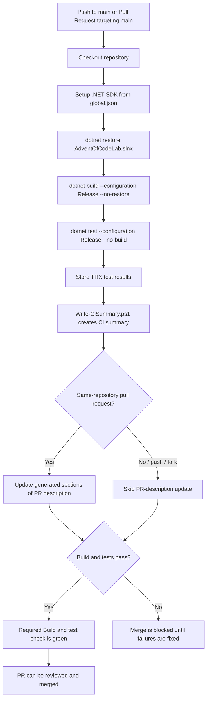

## 5. GitHub CI flow

```mermaid
flowchart TD
    CHANGE["Push to main or Pull Request targeting main"]
    CHECKOUT["Checkout repository"]
    SDK["Setup .NET SDK from global.json"]
    RESTORE["dotnet restore AdventOfCodeLab.slnx"]
    BUILD["dotnet build --configuration Release --no-restore"]
    TEST["dotnet test --configuration Release --no-build"]
    TRX["Store TRX test results"]
    SUMMARY["Write-CiSummary.ps1 creates CI summary"]
    EVENT{"Same-repository pull request?"}
    UPDATE["Update generated sections of PR description"]
    SKIP["Skip PR-description update"]
    STATUS{"Build and tests pass?"}
    GREEN["Required Build and test check is green"]
    RED["Merge is blocked until failures are fixed"]
    MERGE["PR can be reviewed and merged"]

    CHANGE --> CHECKOUT --> SDK --> RESTORE --> BUILD --> TEST --> TRX --> SUMMARY --> EVENT
    EVENT -- Yes --> UPDATE --> STATUS
    EVENT -- No / push / fork --> SKIP --> STATUS
    STATUS -- Yes --> GREEN --> MERGE
    STATUS -- No --> RED
```