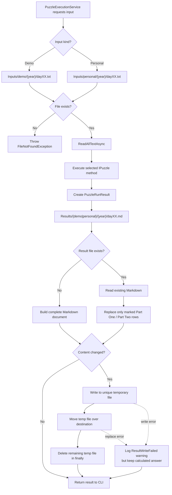

## 3. Input and result file flow

```mermaid
flowchart TD
    REQUEST["PuzzleExecutionService requests input"]
    KIND{"Input kind?"}
    DEMO["Inputs/demo/{year}/dayXX.txt"]
    PERSONAL["Inputs/personal/{year}/dayXX.txt"]
    EXISTS{"File exists?"}
    READ["ReadAllTextAsync"]
    SOLVE["Execute selected IPuzzle method"]
    RUNRESULT["Create PuzzleRunResult"]
    RESULTPATH["Results/{demo|personal}/{year}/dayXX.md"]
    RESULTEXISTS{"Result file exists?"}
    NEWDOC["Build complete Markdown document"]
    EXISTING["Read existing Markdown"]
    MERGE["Replace only marked Part One / Part Two rows"]
    CHANGED{"Content changed?"}
    TEMP["Write to unique temporary file"]
    MOVE["Move temp file over destination"]
    CLEANUP["Delete remaining temp file in finally"]
    DONE["Return result to CLI"]
    NOTFOUND["Throw FileNotFoundException"]
    WARNING["Log ResultWriteFailed warning<br/>but keep calculated answer"]

    REQUEST --> KIND
    KIND -- Demo --> DEMO
    KIND -- Personal --> PERSONAL
    DEMO --> EXISTS
    PERSONAL --> EXISTS
    EXISTS -- No --> NOTFOUND
    EXISTS -- Yes --> READ
    READ --> SOLVE
    SOLVE --> RUNRESULT
    RUNRESULT --> RESULTPATH
    RESULTPATH --> RESULTEXISTS
    RESULTEXISTS -- No --> NEWDOC
    RESULTEXISTS -- Yes --> EXISTING --> MERGE
    NEWDOC --> CHANGED
    MERGE --> CHANGED
    CHANGED -- No --> DONE
    CHANGED -- Yes --> TEMP --> MOVE --> CLEANUP --> DONE

    TEMP -. write error .-> WARNING --> DONE
    MOVE -. replace error .-> WARNING
```