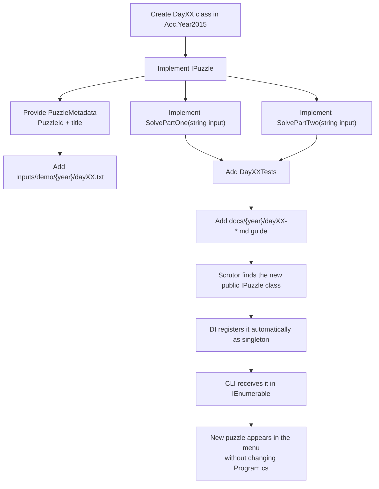

## 4. Puzzle extension flow

```mermaid
flowchart TD
    NEWDAY["Create DayXX class in Aoc.Year2015"]
    CONTRACT["Implement IPuzzle"]
    META["Provide PuzzleMetadata<br/>PuzzleId + title"]
    PART1["Implement SolvePartOne(string input)"]
    PART2["Implement SolvePartTwo(string input)"]
    DEMOINPUT["Add Inputs/demo/{year}/dayXX.txt"]
    TESTS["Add DayXXTests"]
    GUIDE["Add docs/{year}/dayXX-*.md guide"]
    SCAN["Scrutor finds the new public IPuzzle class"]
    REGISTER["DI registers it automatically as singleton"]
    MENU["CLI receives it in IEnumerable<IPuzzle>"]
    AVAILABLE["New puzzle appears in the menu<br/>without changing Program.cs"]

    NEWDAY --> CONTRACT
    CONTRACT --> META
    CONTRACT --> PART1
    CONTRACT --> PART2
    META --> DEMOINPUT
    PART1 --> TESTS
    PART2 --> TESTS
    TESTS --> GUIDE
    GUIDE --> SCAN --> REGISTER --> MENU --> AVAILABLE
```