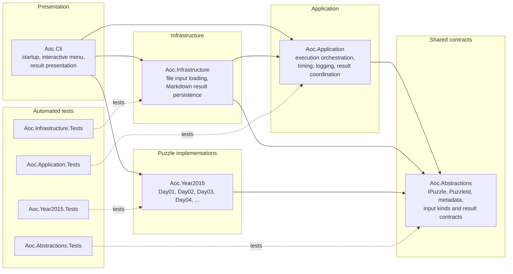

## 1. Solution architecture

```mermaid
flowchart LR
    subgraph Presentation["Presentation"]
        CLI["Aoc.Cli<br/>startup, interactive menu,<br/>result presentation"]
    end

    subgraph Application["Application"]
        APP["Aoc.Application<br/>execution orchestration,<br/>timing, logging, result coordination"]
    end

    subgraph Infrastructure["Infrastructure"]
        INFRA["Aoc.Infrastructure<br/>file input loading,<br/>Markdown result persistence"]
    end

    subgraph DomainContracts["Shared contracts"]
        ABS["Aoc.Abstractions<br/>IPuzzle, PuzzleId, metadata,<br/>input kinds and result contracts"]
    end

    subgraph PuzzleImplementations["Puzzle implementations"]
        YEAR["Aoc.Year2015<br/>Day01, Day02, Day03, Day04, ..."]
    end

    CLI --> APP
    CLI --> INFRA
    CLI --> YEAR
    APP --> ABS
    INFRA --> APP
    INFRA --> ABS
    YEAR --> ABS

    subgraph Tests["Automated tests"]
        TABS["Aoc.Abstractions.Tests"]
        TAPP["Aoc.Application.Tests"]
        TINFRA["Aoc.Infrastructure.Tests"]
        TYEAR["Aoc.Year2015.Tests"]
    end

    TABS -. tests .-> ABS
    TAPP -. tests .-> APP
    TINFRA -. tests .-> INFRA
    TYEAR -. tests .-> YEAR
```